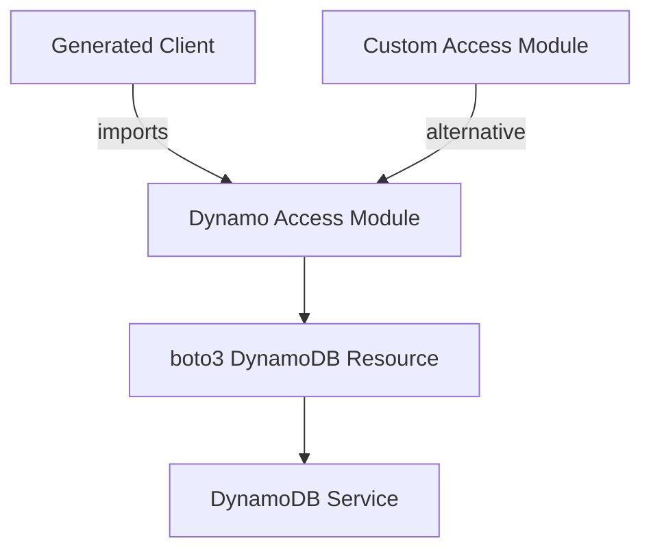

# DynamoDB Access

Prismarine abstracts DynamoDB access through pluggable modules, allowing customization of how DynamoDB resources are created and accessed. This architecture enables different environments, authentication methods, and access patterns.

## Overview



## Core Components

### Dynamo Access Interface

All Dynamo access modules must provide a `get_dynamo_access()` function that returns a boto3 DynamoDB resource:

```python
def get_dynamo_access() -> boto3.resources.base.ServiceResource:
    """Return a configured boto3 DynamoDB resource"""
    # Implementation here
```

**Requirements:**
- Must return a boto3 DynamoDB resource
- Must be importable from the specified module
- Must handle configuration and authentication

### Default Dynamo Access

The default implementation in `prismarine.runtime.dynamo_default`:

```python
# src/prismarine/runtime/dynamo_default.py
def get_dynamo_access():
    """Create a default DynamoDB resource using boto3 default configuration"""
    import boto3
    return boto3.resource('dynamodb')
```

**Features:**
- Uses boto3 default configuration
- Respects AWS credentials from environment
- Works with standard AWS credential providers
- No custom configuration needed

## Configuration Options

### Environment Variables

The default Dynamo access respects standard AWS environment variables:

```bash
# AWS credentials
AWS_ACCESS_KEY_ID=your_access_key_id
AWS_SECRET_ACCESS_KEY=your_secret_access_key
AWS_SESSION_TOKEN=your_session_token  # Optional

# AWS region
AWS_DEFAULT_REGION=us-west-2
AWS_REGION=us-west-2

# DynamoDB endpoint (for local testing)
AWS_DYNAMODB_ENDPOINT_URL=http://localhost:8000
```

### AWS Profile

```bash
# Use specific AWS profile
export AWS_PROFILE=my-profile

# Or use named profile in code
import boto3
session = boto3.Session(profile_name='my-profile')
dynamodb = session.resource('dynamodb')
```

## Custom Access Modules

### Creating a Custom Module

```python
# myapp/dynamo_access.py
def get_dynamo_access():
    """Custom DynamoDB access with specific configuration"""
    import boto3
    from botocore.config import Config
    
    # Custom configuration
    config = Config(
        retries={
            'max_attempts': 3,
            'mode': 'standard'
        },
        connect_timeout=5,
        read_timeout=30
    )
    
    # Create resource with custom config
    dynamodb = boto3.resource(
        'dynamodb',
        region_name='us-west-2',
        endpoint_url='http://localhost:8000',  # Local DynamoDB
        config=config
    )
    
    return dynamodb
```

### Using Custom Access Module

```bash
prismarine generate-client --base . mypackage --dynamo-access-module myapp.dynamo_access
```

**Generated Client Import:**
```python
from myapp.dynamo_access import get_dynamo_access
```

## Advanced Configuration

### Multiple Environments

```python
# environments.py
import os
from botocore.config import Config

def get_dynamo_access():
    """Environment-specific DynamoDB access"""
    env = os.environ.get('ENVIRONMENT', 'development')
    
    if env == 'production':
        return _get_production_dynamo()
    elif env == 'staging':
        return _get_staging_dynamo()
    else:
        return _get_development_dynamo()

def _get_production_dynamo():
    return boto3.resource('dynamodb', region_name='us-east-1')

def _get_staging_dynamo():
    return boto3.resource('dynamodb', region_name='us-west-2')

def _get_development_dynamo():
    return boto3.resource(
        'dynamodb',
        region_name='us-west-2',
        endpoint_url='http://localhost:8000'
    )
```

### Custom Retry Logic

```python
# retry_dynamo.py
def get_dynamo_access():
    """DynamoDB with custom retry logic"""
    import boto3
    from botocore.config import Config
    
    config = Config(
        retries={
            'max_attempts': 10,
            'mode': 'adaptive'  # Exponential backoff
        }
    )
    
    return boto3.resource('dynamodb', config=config)
```

### Cross-Region Access

```python
# multi_region.py
def get_dynamo_access():
    """Multi-region DynamoDB access"""
    import boto3
    
    # Primary region
    primary = boto3.resource('dynamodb', region_name='us-east-1')
    
    # Fallback region
    fallback = boto3.resource('dynamodb', region_name='us-west-2')
    
    # Return a wrapper that handles failover
    return DynamoFallbackAccess(primary, fallback)

class DynamoFallbackAccess:
    def __init__(self, primary, fallback):
        self.primary = primary
        self.fallback = fallback
    
    def Table(self, table_name):
        try:
            return self.primary.Table(table_name)
        except Exception:
            return self.fallback.Table(table_name)
```

## Runtime Integration

### Generated Client Usage

```python
# In generated client
from {access_module} import get_dynamo_access

dynamo = get_dynamo_access()

# Usage in CRUD operations
class TeamModel(Model):
    @staticmethod
    def put(team):
        return _put_item(
            table_name=TeamModel.table_name,
            item=team
        )
```

### Access Module Resolution

The access module path is passed to the generation process:

```python
# In prisma_client.py
HEADER_TEMPLATE = """\
...
from {access_module} import get_dynamo_access
"""

# During generation
code = Template(HEADER_TEMPLATE).render(
    access_module=access_module,  # e.g., 'prismarine.runtime.dynamo_default'
    ...
)
```

## Testing and Development

### Local DynamoDB

For local development and testing:

```python
# local_dynamo.py
def get_dynamo_access():
    """Local DynamoDB for development"""
    import boto3
    
    return boto3.resource(
        'dynamodb',
        region_name='localhost',
        endpoint_url='http://localhost:8000',
        aws_access_key_id='dummy',
        aws_secret_access_key='dummy'
    )
```

**Requirements:**
- Local DynamoDB running (e.g., Docker)
- Tables created in local DynamoDB
- Same table names as in production

### Mock Access for Tests

```python
# tests/conftest.py
import pytest
from unittest.mock import MagicMock

def get_mock_dynamo_access():
    """Mock DynamoDB for testing"""
    mock = MagicMock()
    mock.Table.return_value = MagicMock()
    return mock

@pytest.fixture
def mock_dynamo(monkeypatch):
    monkeypatch.setattr(
        'myapp.dynamo_access.get_dynamo_access',
        get_mock_dynamo_access
    )
```

## Performance Considerations

### Connection Pooling

boto3 automatically manages connection pooling. For high-throughput applications:

```python
# performance_dynamo.py
def get_dynamo_access():
    """Optimized DynamoDB access"""
    import boto3
    from botocore.config import Config
    
    config = Config(
        connect_timeout=2,
        read_timeout=10,
        retries={'max_attempts': 5}
    )
    
    return boto3.resource('dynamodb', config=config)
```

### Batch Operations

For batch operations, consider:

```python
# batch_dynamo.py
def get_dynamo_access():
    """DynamoDB with batch operation support"""
    import boto3
    
    dynamodb = boto3.resource('dynamodb')
    
    # Add batch helper methods
    dynamodb.batch_write_items = _batch_write
    dynamodb.batch_get_items = _batch_get
    
    return dynamodb
```

## Security Considerations

### IAM Roles

Use IAM roles for production environments:

```python
# iam_role_dynamo.py
def get_dynamo_access():
    """DynamoDB access via IAM role"""
    import boto3
    
    # IAM role will be automatically assumed
    return boto3.resource('dynamodb')
```

**Best Practices:**
- Use least privilege IAM policies
- Rotate credentials regularly
- Use temporary credentials for CI/CD
- Monitor access patterns

### Encryption

DynamoDB encryption is handled at the table level. For client-side encryption:

```python
# encrypted_dynamo.py
from cryptography.fernet import Fernet

def get_dynamo_access():
    """DynamoDB with client-side encryption"""
    import boto3
    
    dynamodb = boto3.resource('dynamodb')
    
    # Wrap Table method for encryption
    original_table = dynamodb.Table
    
    def encrypted_table(table_name):
        table = original_table(table_name)
        return EncryptedTable(table)
    
    dynamodb.Table = encrypted_table
    return dynamodb

class EncryptedTable:
    def __init__(self, table):
        self.table = table
        self.cipher = Fernet(b'your-encryption-key')
    
    def put_item(self, item):
        encrypted_item = {k: self._encrypt(v) for k, v in item.items()}
        return self.table.put_item(Item=encrypted_item)
    
    def get_item(self, key):
        response = self.table.get_item(Key=key)
        if 'Item' in response:
            response['Item'] = {k: self._decrypt(v) for k, v in response['Item'].items()}
        return response
    
    def _encrypt(self, value):
        return self.cipher.encrypt(str(value).encode())
    
    def _decrypt(self, value):
        return self.cipher.decrypt(value).decode()
```

## Change Navigation

- **When to consult this page**: When configuring DynamoDB access, troubleshooting connection issues, or customizing access patterns
- **Runtime invariants**:
  - DynamoDB resource must be properly configured
  - Access module must return boto3 DynamoDB resource
  - Generated client must import access module correctly
  - All CRUD operations must work with the configured resource
- **Extension points**:
  - Custom access modules
  - Environment-specific configurations
  - Retry and timeout customization
  - Multi-region access patterns
  - Security enhancements
- **Source files**:
  - `src/prismarine/runtime/dynamo_default.py` (default implementation)
  - `src/prismarine/prisma_client.py` (access module integration)
  - `src/prismarine/cli.py` (CLI option handling)
- **Focused tests**:
  - `tests/test_dynamo_access.py` (access module tests)
  - `tests/test_connection.py` (connection tests)
  - `tests/test_generated_client.py` (integration tests)
- **Validation**:
  - `pytest tests/test_dynamo_access.py -v` (run access tests)
  - `prismarine generate-client --dynamo-access-module help` (CLI validation)
  - Verify generated client imports correctly

## Common Patterns

### Development Configuration

```python
# dev_dynamo.py
import os
from botocore.config import Config

def get_dynamo_access():
    """Development DynamoDB configuration"""
    env = os.environ.get('ENV', 'local')
    
    if env == 'local':
        # Local DynamoDB
        return _get_local_dynamo()
    elif env == 'test':
        # Test DynamoDB
        return _get_test_dynamo()
    else:
        # Shared development DynamoDB
        return _get_dev_dynamo()

def _get_local_dynamo():
    import boto3
    return boto3.resource(
        'dynamodb',
        region_name='localhost',
        endpoint_url='http://localhost:8000',
        aws_access_key_id='dummy',
        aws_secret_access_key='dummy'
    )

def _get_test_dynamo():
    import boto3
    return boto3.resource(
        'dynamodb',
        region_name='us-west-2'
    )

def _get_dev_dynamo():
    import boto3
    config = Config(connect_timeout=3, read_timeout=15)
    return boto3.resource('dynamodb', config=config)
```

### Production with Monitoring

```python
# prod_dynamo.py
import boto3
from botocore.config import Config
import logging

logger = logging.getLogger(__name__)

def get_dynamo_access():
    """Production DynamoDB with monitoring"""
    config = Config(
        retries={'max_attempts': 5, 'mode': 'adaptive'},
        connect_timeout=2,
        read_timeout=10
    )
    
    dynamodb = boto3.resource('dynamodb', config=config)
    
    # Add monitoring hooks
    _setup_monitoring(dynamodb)
    
    return dynamodb

def _setup_monitoring(dynamodb):
    """Setup monitoring for DynamoDB operations"""
    original_put_item = dynamodb.Table('*').put_item
    
    def monitored_put_item(*args, **kwargs):
        logger.info('DynamoDB put_item operation')
        start = time.time()
        try:
            result = original_put_item(*args, **kwargs)
            logger.info(f'DynamoDB put_item completed in {time.time() - start:.2f}s')
            return result
        except Exception as e:
            logger.error(f'DynamoDB put_item failed: {e}')
            raise
    
    dynamodb.Table = lambda name: _wrap_table(dynamodb, name, monitored_put_item)

def _wrap_table(dynamodb, name, put_item_func):
    table = dynamodb.Table(name)
    table.put_item = put_item_func
    return table
```

### CI/CD Integration

```python
# ci_dynamo.py
import os
import boto3

def get_dynamo_access():
    """CI/CD DynamoDB access"""
    # Use GitHub Actions or other CI credentials
    return boto3.resource('dynamodb')
```

**GitHub Actions Example:**
```yaml
- name: Configure AWS Credentials
  uses: aws-actions/configure-aws-credentials@v2
  with:
    role-to-assume: arn:aws:iam::123456789012:role/gh-actions-dynamodb
    aws-region: us-west-2

- name: Run tests
  run: |
    prismarine generate-client --base . mypackage --dynamo-access-module ci_dynamo
    pytest tests/
```

### Multi-Tenant Access

```python
# multi_tenant.py
from functools import lru_cache

def get_dynamo_access(tenant_id=None):
    """Multi-tenant DynamoDB access"""
    if tenant_id:
        return _get_tenant_dynamo(tenant_id)
    return _get_default_dynamo()

@lru_cache(maxsize=100)
def _get_tenant_dynamo(tenant_id):
    """Get DynamoDB resource for specific tenant"""
    import boto3
    
    # Use tenant-specific configuration
    dynamodb = boto3.resource(
        'dynamodb',
        region_name=f'tenant-{tenant_id}'
    )
    
    # Add tenant context
    dynamodb.tenant_id = tenant_id
    
    return dynamodb

def _get_default_dynamo():
    """Get default DynamoDB resource"""
    import boto3
    return boto3.resource('dynamodb')
```

## Troubleshooting

### Connection Timeout

**Problem**: Connection to DynamoDB times out

**Solution**:
1. Check network connectivity
2. Verify AWS region is correct
3. Check endpoint URL for local DynamoDB
4. Increase timeout settings in custom access module
5. Verify credentials are valid

### Access Denied

**Problem**: Permission errors when accessing DynamoDB

**Solution**:
1. Check IAM permissions
2. Verify credentials have proper DynamoDB access
3. Check resource-based policies
4. Use `--verbose` flag to see detailed errors
5. Test with AWS CLI: `aws dynamodb list-tables`

### Resource Not Found

**Problem**: Table not found errors

**Solution**:
1. Verify table exists in the correct region
2. Check table name in model definition
3. Verify table was created in local DynamoDB
4. Check for typos in table names
5. Use full table names (prefix + model name)

### Performance Issues

**Problem**: Slow DynamoDB operations

**Solution**:
1. Check for hot partitions
2. Review query patterns
3. Add proper indexes
4. Consider provisioned vs on-demand capacity
5. Check network latency
6. Review boto3 configuration (timeouts, retries)

### Credential Issues

**Problem**: Invalid credentials or authentication errors

**Solution**:
1. Verify AWS credentials are set
2. Check credential file locations:
   - `~/.aws/credentials`
   - `~/.aws/config`
3. Verify environment variables
4. Check IAM role permissions
5. Test with AWS CLI: `aws sts get-caller-identity`

### Local DynamoDB Issues

**Problem**: Local DynamoDB not working

**Solution**:
1. Verify DynamoDB Local is running
2. Check endpoint URL: `http://localhost:8000`
3. Verify tables exist in local DynamoDB
4. Check Docker container status
5. Verify credentials for local DynamoDB (can be dummy values)

## Migration Guide

### From Default to Custom Access

**Before:**
```bash
prismarine generate-client --base . mypackage
```

**After:**
```python
# Create custom access module
# myapp/dynamo.py
def get_dynamo_access():
    import boto3
    return boto3.resource('dynamodb', region_name='us-west-2')

# Update generation command
prismarine generate-client --base . mypackage --dynamo-access-module myapp.dynamo
```

### Environment-Specific Configuration

**Before:**
```python
# Hardcoded configuration in application
```

**After:**
```python
# Dynamic configuration via access module
# environments.py
def get_dynamo_access():
    import os
    env = os.environ.get('ENV', 'development')
    
    if env == 'production':
        return boto3.resource('dynamodb', region_name='us-east-1')
    else:
        return boto3.resource('dynamodb', region_name='us-west-2')
```

**Usage:**
```bash
export ENV=production
prismarine generate-client --base . mypackage --dynamo-access-module environments
```