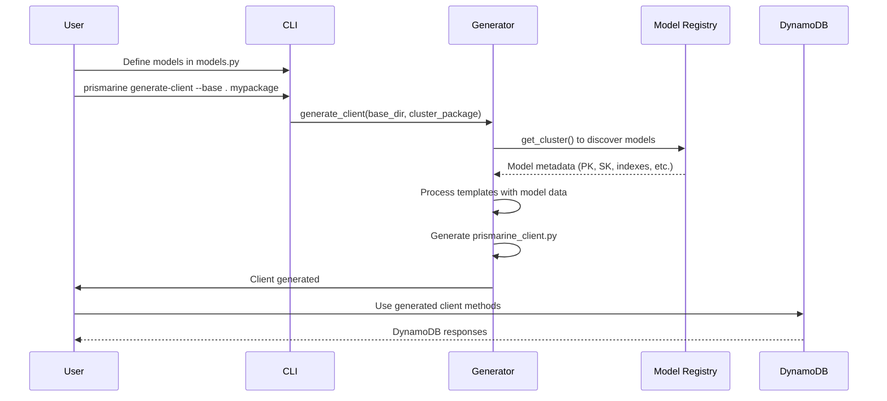

# Architecture Overview

Prismarine follows a **code-generation architecture** where models are defined in Python, and a client library is automatically generated for database operations. This approach provides type safety, IDE support, and reduces boilerplate while maintaining flexibility.

## High-Level Architecture

```mermaid
graph TD
    A[Model Definition] -->|Cluster.model()| B[Model Registry]
    B --> C[Code Generator]
    C --> D[Generated Client]
    D --> E[DynamoDB via boto3]
    F[CLI] --> C
    G[Configuration] --> C
```

## Core Components

### 1. Model Definition Layer (`src/prismarine/runtime/cluster.py`)

The `Cluster` class is the central abstraction for defining models:

- **Model Registration**: `@Cluster.model()` decorator registers models with their primary/sort keys
- **Index Support**: `@Cluster.index()` decorator adds secondary indexes
- **Trigger Configuration**: Support for DynamoDB Stream Triggers via EasySAM
- **TTL Support**: Automatic TTL field handling

**Key Classes:**
- `Cluster` - Main decorator class
- `TriggerConfig` - DynamoDB Stream configuration for EasySAM

### 2. Code Generation Layer (`src/prismarine/prisma_client.py`)

The client generation system:

- **Template Engine**: Uses Mako templates for code generation
- **Multiple Model Libraries**: Supports both `TypedDict` (default) and `pydantic.BaseModel`
- **Customizable Dynamo Access**: Pluggable DynamoDB access modules
- **Extra Imports**: Support for adding custom imports to generated client

**Generation Process:**
1. Discover models via `get_cluster()` from `prisma_common.py`
2. Process model metadata (PK/SK, indexes, triggers, TTL)
3. Generate Python classes with CRUD methods
4. Apply Mako templates for consistent formatting
5. Write generated client to `prismarine_client.py`

### 3. Runtime Layer (`src/prismarine/runtime/`)

The runtime provides the actual DynamoDB operations:

- **CRUD Operations**: `_query`, `_get_item`, `_update`, `_put_item`, `_delete`, `_scan`, `_save`
- **Model Base Class**: `Model` - base class for all generated models
- **Dynamo Access Abstraction**: Pluggable access modules via `get_dynamo_access()`
- **Default Implementation**: `DefaultDynamoAccess` in `dynamo_default.py`

### 4. CLI Layer (`src/prismarine/cli.py`)

The command-line interface provides user-friendly access to generation:

- **Main Command**: `prismarine` with subcommands
- **Client Generation**: `prismarine generate-client`
- **Version Check**: `prismarine version`
- **Configuration Options**: Path configuration, verbose logging, extra imports

## Data Flow



## Integration Points

### DynamoDB Access Modules

Prismarine supports pluggable DynamoDB access via the `--dynamo-access-module` option:

- **Default**: Uses `DefaultDynamoAccess` from `prismarine.runtime.dynamo_default`
- **Custom**: Users can provide their own module with `get_dynamo_access()` function

### Model Libraries

Two model library options are supported:

1. **TypedDict (default)**: Uses Python's built-in `TypedDict`
2. **Pydantic**: Uses `pydantic.BaseModel` for validation and serialization

### EasySAM Integration

For DynamoDB Stream Triggers:

- **TriggerConfig**: Configuration for stream processing
- **Function**: Lambda function name
- **View Types**: keys-only, new, old, new-and-old
- **Batch Configuration**: batch size and window settings

## Generated Client Structure

Each generated model includes:

```python
class ModelNameModel(Model):
    table_name = 'TablePrefixModelName'
    PK = 'PartitionKey'
    SK = 'SortKey'
    
    class UpdateDTO(TypedDict, total=False):
        # All fields as optional
        
    @staticmethod
    def list(**key_values) -> List[ModelType]: ...
    
    @staticmethod  
    def get(**key_values) -> ModelType: ...
    
    @staticmethod
    def put(item: ModelType) -> ModelType: ...
    
    @staticmethod
    def update(update_dto: UpdateDTO, **key_values) -> ModelType: ...
    
    @staticmethod
    def save(updated: ModelType, original: ModelType | None = None) -> ModelType: ...
    
    @staticmethod
    def delete(**key_values): ...
    
    @staticmethod
    def scan() -> List[ModelType]: ...
```

## Configuration and Setup

### Runtime Dependencies

- **boto3**: AWS SDK for DynamoDB operations
- **mako**: Template engine for code generation
- **case-converter**: For naming conventions
- **ruff**: Code formatting (replaced gray-formatter)

### Optional Dependencies

- **pydantic**: For Pydantic model support (`prismarine[pydantic]`)

## Change Navigation

- **When to consult this page**: When planning architecture changes, understanding system boundaries, or troubleshooting integration issues
- **Runtime invariants**: 
  - Generated client must be importable and functional
  - Type hints must be preserved in generated code
  - DynamoDB operations must use boto3 correctly
- **Extension points**:
  - Custom DynamoDB access modules
  - Additional model libraries
  - New CLI options
  - Template modifications
- **Source files**:
  - `src/prismarine/runtime/cluster.py` (model definition)
  - `src/prismarine/prisma_client.py` (generation logic)
  - `src/prismarine/prisma_common.py` (utility functions)
  - `src/prismarine/cli.py` (CLI interface)
- **Focused tests**:
  - `tests/test_cluster.py` (model registration)
  - `tests/test_generate_client.py` (generation logic)
  - `tests/test_dynamo_access.py` (runtime operations)
- **Validation**:
  - `prismarine generate-client --help` (CLI validation)
  - `pytest tests/test_generate_client.py` (generation tests)

## Common Extension Patterns

### Adding a New Model Library

1. Create a new template variant in `prisma_client.py`
2. Add a new `--model-library` option to CLI
3. Update generation logic to handle the new library format
4. Add tests for the new library type

### Custom Dynamo Access Module

1. Create a module with `get_dynamo_access()` function
2. Use `--dynamo-access-module path.to.module` when generating client
3. Ensure the function returns a DynamoDB resource-compatible object
4. Test with custom access patterns

### Adding New CRUD Methods

1. Update the Mako template in `prisma_client.py`
2. Add the method to the `Model` base class in runtime
3. Update the generation logic to include new methods
4. Add comprehensive tests for the new functionality