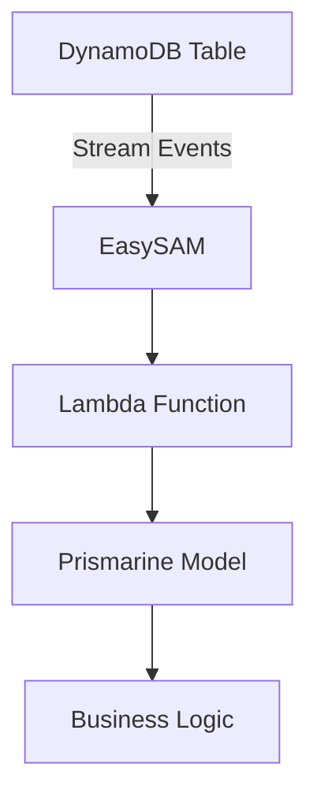

# EasySAM Integration

Prismarine integrates with [EasySAM](https://github.com/scartill/easysam) to provide DynamoDB Stream Trigger support. This integration enables automatic processing of DynamoDB stream events with configurable batch sizes, windowing, and view types.

## Overview

EasySAM is a serverless application model for AWS Lambda that simplifies the deployment and management of Lambda functions triggered by DynamoDB streams. Prismarine's integration makes it easy to configure triggers directly in your model definitions.



## Core Components

### TriggerConfig

The `TriggerConfig` class defines DynamoDB Stream trigger configuration:

```python
from prismarine import TriggerConfig

trigger_config = TriggerConfig(
    function='my-lambda-function',
    viewtype='new-and-old',
    batchsize=100,
    batchwindow=5,
    startingposition='latest'
)
```

**Parameters:**

| Parameter | Type | Required | Description | Default |
|-----------|------|----------|-------------|---------|
| `function` | str | Yes | Lambda function name | - |
| `viewtype` | str | No | Stream view type | 'keys-only' |
| `batchsize` | int | No | Number of records per batch | 100 |
| `batchwindow` | int | No | Time window in seconds | 5 |
| `startingposition` | str | No | Stream position | 'latest' |

**View Types:**
- `'keys-only'`: Only the key attributes of the modified item
- `'new'`: The entire item as it appears after it was modified
- `'old'`: The entire item as it appeared before it was modified
- `'new-and-old'`: Both the new and the old images of the item

### Model Integration

Add trigger configuration to your model definition:

```python
from prismarine import Cluster, TriggerConfig

c = Cluster('MyApp')

trigger_config = TriggerConfig(
    function='process-user-events',
    viewtype='new-and-old',
    batchsize=50,
    batchwindow=2
)

@c.model(PK='user_id', SK='session', trigger=trigger_config)
class UserSession:
    user_id: str
    session_id: str
    expires_at: int
    ip_address: str
```

## Configuration Options

### Basic Trigger

```python
trigger = TriggerConfig(
    function='handle-user-updates'
)
```

**Result:**
- Uses default values for all optional parameters
- Processes keys-only stream records
- Batch size: 100 records
- Batch window: 5 seconds
- Starting position: 'latest'

### Full Configuration

```python
trigger = TriggerConfig(
    function='process-orders',
    viewtype='new',
    batchsize=200,
    batchwindow=10,
    startingposition='trim-horizon'
)
```

**Behavior:**
- Processes full new images of modified items
- Larger batch size for efficiency
- Longer batch window for aggregation
- Processes all existing records first

### Multiple Triggers

You can define different triggers for different models:

```python
# User events trigger
user_trigger = TriggerConfig(
    function='process-user-events',
    viewtype='new-and-old',
    batchsize=100
)

# Order events trigger  
order_trigger = TriggerConfig(
    function='process-order-events',
    viewtype='new',
    batchsize=50
)

@c.model(PK='user_id', SK='session', trigger=user_trigger)
class UserSession:
    user_id: str
    session_id: str

@c.model(PK='order_id', SK='details', trigger=order_trigger)
class Order:
    order_id: str
    user_id: str
    total: float
```

## EasySAM Deployment

### Prerequisites

1. **EasySAM Installed**: EasySAM must be installed in your AWS account
2. **Lambda Functions**: Lambda functions must exist and be configured
3. **IAM Permissions**: Lambda functions need DynamoDB stream read permissions
4. **DynamoDB Streams**: DynamoDB tables must have streams enabled

### Deployment Steps

1. **Define Triggers in Models**
2. **Generate Client Code**
3. **Deploy EasySAM Application**
4. **Verify Stream Processing**

### Example Deployment

```bash
# 1. Define models with triggers
# models.py
from prismarine import Cluster, TriggerConfig

c = Cluster('MyApp')

trigger = TriggerConfig(
    function='process-events',
    viewtype='new-and-old',
    batchsize=100
)

@c.model(PK='item_id', trigger=trigger)
class Item:
    item_id: str
    name: str
    status: str

# 2. Generate client
prismarine generate-client --base . mypackage

# 3. Deploy EasySAM
easysam deploy --app myapp --region us-west-2

# 4. Verify
easysam status --app myapp
```

## Generated Client Integration

When a model has a trigger configured, the generated client includes trigger metadata:

```python
class ItemModel(Model):
    table_name = 'MyAppItem'
    PK = 'item_id'
    
    # Trigger metadata
    trigger = {
        'function': 'process-events',
        'viewtype': 'new-and-old',
        'batchsize': 100,
        'batchwindow': 5,
        'startingposition': 'latest'
    }
```

**Accessing Trigger Metadata:**
```python
# In your Lambda function
from mypackage.prismarine_client import ItemModel

trigger_config = ItemModel.trigger
function_name = trigger_config['function']
view_type = trigger_config['viewtype']
```

## Best Practices

### 1. Batch Size Selection

Choose batch size based on:
- Lambda timeout configuration
- Memory requirements
- Processing time per record
- Expected throughput

**Guidelines:**
- Start with 100-200 records per batch
- Monitor Lambda execution time
- Adjust based on performance metrics
- Consider error handling requirements

### 2. View Type Selection

Choose view type based on data requirements:

- **keys-only**: Minimal data, good for simple processing
- **new**: Full item after modification, good for most use cases
- **old**: Full item before modification, good for change detection
- **new-and-old**: Both images, good for complex change analysis

### 3. Error Handling

Implement robust error handling in your Lambda functions:

```python
import json
import boto3
from mypackage.prismarine_client import ItemModel

def lambda_handler(event, context):
    for record in event['Records']:
        try:
            # Process record
            item = record['dynamodb']['NewImage']
            process_item(item)
            
        except Exception as e:
            # Handle error
            log_error(record, e)
            # Optionally send to DLQ
            send_to_dlq(record, e)
            
    return {'statusCode': 200}

def process_item(item):
    # Your business logic here
    pass

def log_error(record, error):
    # Log error to CloudWatch
    pass

def send_to_dlq(record, error):
    # Send failed record to Dead Letter Queue
    sqs = boto3.client('sqs')
    sqs.send_message(
        QueueUrl='my-dlq-url',
        MessageBody=json.dumps(record)
    )
```

### 4. Monitoring and Logging

Set up CloudWatch alarms and logging:

```python
import logging
import boto3

logger = logging.getLogger()
logger.setLevel(logging.INFO)

cloudwatch = boto3.client('cloudwatch')

# Log metrics
def log_metrics(records_processed, processing_time):
    cloudwatch.put_metric_data(
        Namespace='MyApp/DynamoDBTriggers',
        MetricData=[
            {
                'MetricName': 'RecordsProcessed',
                'Value': records_processed,
                'Unit': 'Count'
            },
            {
                'MetricName': 'ProcessingTime',
                'Value': processing_time,
                'Unit': 'Milliseconds'
            }
        ]
    )
```

### 5. Idempotency

Ensure your Lambda functions are idempotent:

```python
def process_item(item):
    item_id = item['item_id']
    
    # Check if already processed
    if is_processed(item_id):
        return
    
    # Process item
    update_database(item)
    mark_as_processed(item_id)

def is_processed(item_id):
    # Check processing state
    pass

def mark_as_processed(item_id):
    # Mark item as processed
    pass
```

## Change Navigation

- **When to consult this page**: When configuring DynamoDB Stream Triggers, troubleshooting trigger issues, or integrating with EasySAM
- **Runtime invariants**:
  - Trigger configuration must be valid
  - Generated client must include trigger metadata
  - Lambda functions must have proper permissions
  - DynamoDB streams must be enabled
- **Extension points**:
  - Custom trigger configurations
  - Advanced error handling
  - Multi-function triggers
  - Custom processing logic
- **Source files**:
  - `src/prismarine/runtime/cluster.py` (TriggerConfig class)
  - `src/prismarine/prisma_client.py` (trigger metadata in generated client)
- **Focused tests**:
  - `tests/test_triggers.py` (trigger configuration tests)
  - `tests/test_easysam.py` (EasySAM integration tests)
  - `tests/test_stream_processing.py` (stream processing tests)
- **Validation**:
  - `pytest tests/test_triggers.py -v` (run trigger tests)
  - `pytest tests/test_easysam.py -v` (run EasySAM integration tests)
  - Verify trigger metadata in generated client

## Common Patterns

### User Activity Tracking

```python
from prismarine import Cluster, TriggerConfig

c = Cluster('UserService')

activity_trigger = TriggerConfig(
    function='track-user-activity',
    viewtype='new',
    batchsize=200,
    batchwindow=10
)

@c.model(PK='user_id', SK='activity', trigger=activity_trigger)
class UserActivity:
    user_id: str
    activity_type: str
    timestamp: str
    metadata: dict
```

**Lambda Function:**
```python
def lambda_handler(event, context):
    for record in event['Records']:
        new_image = record['dynamodb']['NewImage']
        
        user_id = new_image['user_id']
        activity_type = new_image['activity_type']
        timestamp = new_image['timestamp']
        
        # Store in analytics database
        store_activity(user_id, activity_type, timestamp)
        
        # Update user profile
        update_user_stats(user_id, activity_type)
    
    return {'statusCode': 200}
```

### Order Processing Pipeline

```python
from prismarine import Cluster, TriggerConfig

c = Cluster('OrderService')

order_trigger = TriggerConfig(
    function='process-order-events',
    viewtype='new-and-old',
    batchsize=100,
    batchwindow=5
)

payment_trigger = TriggerConfig(
    function='process-payment-events',
    viewtype='new',
    batchsize=50,
    batchwindow=2
)

@c.model(PK='order_id', SK='details', trigger=order_trigger)
class Order:
    order_id: str
    user_id: str
    items: list
    total: float
    status: str

@c.model(PK='payment_id', SK='details', trigger=payment_trigger)
class Payment:
    payment_id: str
    order_id: str
    amount: float
    status: str
```

**Processing Logic:**
```python
def process_order_events(event, context):
    for record in event['Records']:
        new_image = record['dynamodb']['NewImage']
        old_image = record['dynamodb'].get('OldImage')
        
        if old_image:
            # Handle update
            handle_order_update(old_image, new_image)
        else:
            # Handle creation
            handle_new_order(new_image)

def handle_new_order(order):
    # Validate order
    if not is_valid_order(order):
        raise ValueError('Invalid order')
    
    # Process payment
    payment = create_payment(order)
    
    # Update order status
    update_order_status(order['order_id'], 'processing')

def handle_order_update(old_order, new_order):
    # Detect status changes
    if old_order['status'] != new_order['status']:
        handle_status_change(old_order, new_order)
```

### Audit Logging

```python
from prismarine import Cluster, TriggerConfig
import json

c = Cluster('AuditService')

audit_trigger = TriggerConfig(
    function='log-audit-events',
    viewtype='new-and-old',
    batchsize=500,
    batchwindow=15
)

@c.model(PK='entity_type', SK='entity_id', trigger=audit_trigger)
class AuditLog:
    entity_type: str
    entity_id: str
    operation: str
    user_id: str
    timestamp: str
    changes: dict
```

**Audit Lambda Function:**
```python
import json
import boto3
from datetime import datetime

def lambda_handler(event, context):
    dynamodb = boto3.resource('dynamodb')
    audit_table = dynamodb.Table('AuditLogs')
    
    for record in event['Records']:
        new_image = record['dynamodb']['NewImage']
        old_image = record['dynamodb'].get('OldImage')
        
        # Create audit entry
        audit_entry = {
            'log_id': f"{new_image['entity_type']}#{new_image['entity_id']}#{datetime.now().isoformat()}",
            'entity_type': new_image['entity_type'],
            'entity_id': new_image['entity_id'],
            'operation': new_image['operation'],
            'user_id': new_image['user_id'],
            'timestamp': new_image['timestamp'],
            'changes': json.dumps({
                'old': old_image,
                'new': new_image
            })
        }
        
        # Store in audit table
        audit_table.put_item(Item=audit_entry)
    
    return {'statusCode': 200}
```

### Data Synchronization

```python
from prismarine import Cluster, TriggerConfig

c = Cluster('SyncService')

sync_trigger = TriggerConfig(
    function='sync-to-external-system',
    viewtype='new',
    batchsize=100,
    batchwindow=10
)

@c.model(PK='record_id', SK='type', trigger=sync_trigger)
class DataRecord:
    record_id: str
    type: str
    data: dict
    last_sync: str
    sync_status: str
```

**Sync Lambda Function:**
```python
import boto3
import requests

def lambda_handler(event, context):
    external_api = ExternalApiClient()
    
    for record in event['Records']:
        new_image = record['dynamodb']['NewImage']
        
        # Check if needs sync
        if new_image.get('sync_status') == 'pending':
            try:
                # Send to external API
                response = external_api.post('/sync', new_image['data'])
                
                # Update sync status
                update_sync_status(
                    new_image['record_id'],
                    new_image['type'],
                    'synced',
                    response['sync_id']
                )
                
            except Exception as e:
                log_error(f"Sync failed: {e}")
                mark_for_retry(new_image['record_id'])
    
    return {'statusCode': 200}

def update_sync_status(record_id, record_type, status, sync_id):
    # Update in DynamoDB
    pass

def mark_for_retry(record_id):
    # Mark for retry with exponential backoff
    pass
```

## Troubleshooting

### Trigger Not Working

**Problem**: DynamoDB stream events not triggering Lambda

**Solution:**
1. Verify DynamoDB streams are enabled on the table
2. Check Lambda function exists and is configured
3. Verify IAM permissions (Lambda needs `dynamodb:GetRecords`, `dynamodb:GetShardIterator`, `dynamodb:DescribeStream`)
4. Check EasySAM configuration
5. Verify trigger configuration in model definition
6. Check CloudWatch logs for errors

### Permission Errors

**Problem**: Lambda function doesn't have permission to access DynamoDB

**Solution:**
1. Check IAM role attached to Lambda function
2. Verify role has `dynamodb:GetRecords`, `dynamodb:GetShardIterator`, `dynamodb:DescribeStream` permissions
3. Check resource-based policies
4. Verify execution role has proper trust relationship with Lambda

### Batch Processing Issues

**Problem**: Batches not being processed correctly

**Solution:**
1. Check batch size configuration
2. Verify Lambda timeout is sufficient for batch size
3. Check for errors in Lambda execution
4. Review batch window configuration
5. Verify view type matches processing requirements

### Data Format Issues

**Problem**: Stream data format doesn't match expectations

**Solution:**
1. Check view type configuration
2. Verify Lambda function expects correct data format
3. Review DynamoDB stream format documentation
4. Add data transformation in Lambda function
5. Check for null values in stream data

### Performance Issues

**Problem**: Stream processing is slow

**Solution:**
1. Review batch size and window configuration
2. Check Lambda memory allocation
3. Optimize Lambda function code
4. Add parallel processing if needed
5. Review DynamoDB read capacity
6. Consider partitioning strategy

### Error Handling Issues

**Problem**: Errors not being handled properly

**Solution:**
1. Implement proper error handling in Lambda function
2. Add dead letter queue (DLQ) configuration
3. Review error logging
4. Add retry logic with exponential backoff
5. Check CloudWatch metrics and alarms

### Configuration Drift

**Problem**: Trigger configuration doesn't match deployed state

**Solution:**
1. Regenerate client after changing trigger configuration
2. Redeploy EasySAM application
3. Verify configuration in AWS Console
4. Check EasySAM deployment logs
5. Compare generated client with deployed configuration

## Monitoring and Operations

### CloudWatch Metrics

EasySAM and Lambda provide CloudWatch metrics:

- **Invocations**: Number of times Lambda is invoked
- **Errors**: Number of failed invocations
- **Duration**: Execution time per invocation
- **Throttles**: Number of throttled invocations
- **IteratorAge**: Age of the last processed record
- **ConcurrentExecutions**: Number of concurrent executions

**Monitoring Queries:**
```sql
# Error rate
ERRORS / INVOCATIONS

# Average duration
AVG(DURATION)

# Throttle rate
THROTTLES / INVOCATIONS

# Iterator age (should be low)
AVG(ITERATOR_AGE_RECORDS)
```

### CloudWatch Alarms

Set up alarms for critical metrics:

```yaml
# CloudFormation template example
Alarms:
  HighErrorRate:
    Type: AWS::CloudWatch::Alarm
    Properties:
      AlarmName: "HighLambdaErrorRate"
      ComparisonOperator: GreaterThanThreshold
      EvaluationPeriods: 1
      MetricName: "Errors"
      Namespace: "AWS/Lambda"
      Period: 300
      Statistic: "Sum"
      Threshold: 5
      Dimensions:
        - Name: "FunctionName"
          Value: "process-events"

  HighIteratorAge:
    Type: AWS::CloudWatch::Alarm
    Properties:
      AlarmName: "HighIteratorAge"
      ComparisonOperator: GreaterThanThreshold
      EvaluationPeriods: 1
      MetricName: "IteratorAge"
      Namespace: "AWS/Lambda"
      Period: 60
      Statistic: "Average"
      Threshold: 60000  # 1 minute
      Dimensions:
        - Name: "FunctionName"
          Value: "process-events"
```

### Logging Best Practices

```python
import logging
import json

logger = logging.getLogger()
logger.setLevel(logging.INFO)

# Log structured JSON for easier querying
logger.info({
    'event': 'process_start',
    'batch_size': len(event['Records']),
    'timestamp': datetime.now().isoformat()
})

# Log errors with context
try:
    process_record(record)
except Exception as e:
    logger.error({
        'event': 'process_error',
        'error': str(e),
        'record': record,
        'timestamp': datetime.now().isoformat()
    })
    raise

# Log completion
logger.info({
    'event': 'process_complete',
    'records_processed': records_processed,
    'processing_time_ms': (time.time() - start_time) * 1000,
    'timestamp': datetime.now().isoformat()
})
```

## Advanced Topics

### Multi-Region Processing

```python
from prismarine import Cluster, TriggerConfig

c = Cluster('GlobalApp')

# Primary region trigger
primary_trigger = TriggerConfig(
    function='process-primary',
    viewtype='new',
    batchsize=200
)

# Failover region trigger
failover_trigger = TriggerConfig(
    function='process-failover',
    viewtype='new',
    batchsize=100
)

@c.model(PK='global_id', SK='type', trigger=primary_trigger)
class GlobalRecord:
    global_id: str
    type: str
    data: dict
    region: str = 'primary'
```

### Custom Processing Logic

```python
from prismarine import Cluster, TriggerConfig
import json

c = Cluster('CustomApp')

custom_trigger = TriggerConfig(
    function='custom-processor',
    viewtype='new-and-old',
    batchsize=50
)

@c.model(PK='item_id', trigger=custom_trigger)
class CustomItem:
    item_id: str
    type: str
    data: dict
```

**Custom Lambda Function:**
```python
def lambda_handler(event, context):
    processor = get_processor(event['Records'][0]['eventSourceARN'])
    
    for record in event['Records']:
        processor.process(record)
    
    return {'statusCode': 200}

class CustomProcessor:
    def __init__(self, event_source_arn):
        self.event_source_arn = event_source_arn
        self.processing_rules = self._load_rules()
    
    def _load_rules(self):
        # Load processing rules based on event source
        return {}
    
    def process(self, record):
        # Custom processing logic
        pass
```

### Event Routing

```python
from prismarine import Cluster, TriggerConfig

c = Cluster('RoutingApp')

# Route by item type
@c.model(PK='item_id', trigger=TriggerConfig(function='route-by-type'))
class TypedItem:
    item_id: str
    type: str
    data: dict

# Route by priority
@c.model(PK='item_id', trigger=TriggerConfig(function='route-by-priority'))
class PriorityItem:
    item_id: str
    priority: int
    data: dict
```

**Routing Lambda:**
```python
def lambda_handler(event, context):
    for record in event['Records']:
        item = record['dynamodb']['NewImage']
        
        # Route based on type
        if item['type'] == 'urgent':
            send_to_urgent_queue(item)
        elif item['type'] == 'normal':
            send_to_normal_queue(item)
        else:
            send_to_default_queue(item)
    
    return {'statusCode': 200}

def send_to_urgent_queue(item):
    # Send to high-priority queue
    pass

def send_to_normal_queue(item):
    # Send to standard queue
    pass

def send_to_default_queue(item):
    # Send to default queue
    pass
```