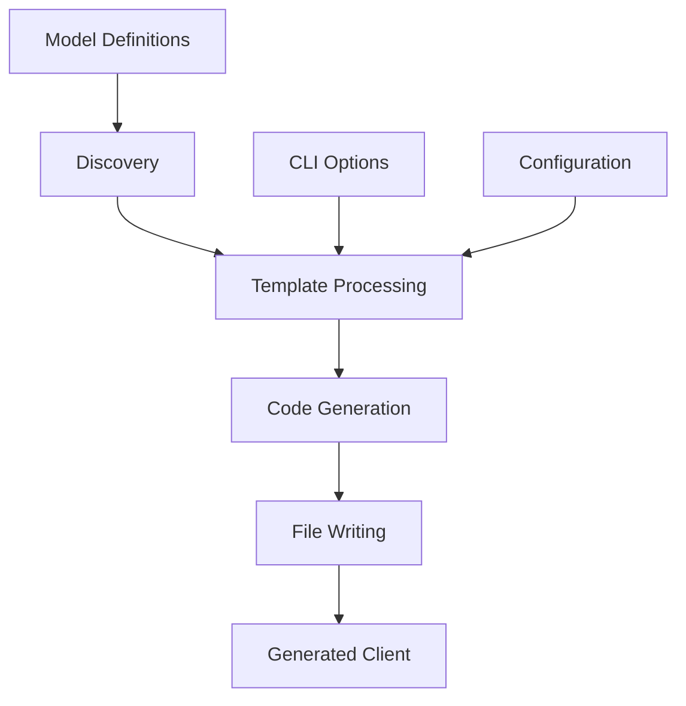

# Client Generation Workflow

The client generation workflow transforms model definitions into a fully functional DynamoDB client library. This process is automated but can be customized through various options.

## Overview



## Generation Process

### 1. Discovery Phase

The generator discovers models through `get_cluster()` in `prisma_common.py`:

```python
from prismarine.prisma_common import get_cluster

cluster = get_cluster('mypackage.models')
# Returns cluster with all registered models
```

**Discovery Steps:**
1. Import the models module
2. Find all classes decorated with `@Cluster.model()`
3. Extract model metadata (PK, SK, indexes, triggers, TTL)
4. Build complete model registry

### 2. Template Processing

Mako templates in `prisma_client.py` define the generated client structure:

```python
HEADER_TEMPLATE = """\
# This file is generated by prismarine {version}. Do not modify it.

from prismarine.runtime.dynamo_crud import (
    _query,
    _get_item,
    _update,
    _put_item,
    _delete,
    _scan,
    _save,
    Model,
    without,
    DbNotFound
)

{type_imports}
from types import EllipsisType

from {access_module} import get_dynamo_access
{helper_block}
"""
```

**Template Components:**
- **Header**: Copyright, imports, version info
- **CRUD Methods**: Generated for each model
- **Type Imports**: Based on model library (TypedDict vs Pydantic)
- **Helper Code**: Pydantic helpers if needed

### 3. Model Processing

Each model is processed to generate:

```python
class {ModelName}Model(Model):
    table_name = '{table_name}'
    PK = '{pk}'
    SK = '{sk}'
    
    class UpdateDTO({dto_base}):
        # All fields as optional
        
    @staticmethod
    def list(**key_values) -> List[{ModelName}]:
        # Query implementation
        ...
    
    # Other CRUD methods...
```

**Processing Steps per Model:**
1. Extract model metadata (PK, SK, table name, indexes, etc.)
2. Determine field types based on model library
3. Generate UpdateDTO class with all fields optional
4. Generate CRUD methods for each operation
5. Add index-specific query methods

### 4. Code Generation

The Mako template engine renders the final code:

```python
from mako.template import Template

code = Template(template_string).render(
    models=cluster.models,
    version=version('prismarine'),
    access_module=access_module,
    type_imports=type_imports,
    helper_block=helper_block,
    model_library=model_library
)
```

**Template Variables:**
- `models`: List of discovered models
- `version`: Prismarine version
- `access_module`: DynamoDB access module path
- `type_imports`: Type imports based on model library
- `helper_block`: Additional helper code
- `model_library`: 'typed_dict' or 'pydantic'

### 5. File Writing

The generated code is written to `prismarine_client.py`:

```python
output_path = base_dir / cluster_package / 'prismarine_client.py'
output_path.write_text(code, encoding='utf-8')
```

**File Location:**
- `{base_dir}/{cluster_package}/prismarine_client.py`
- Must be importable from the cluster package

## CLI Command

### Basic Usage

```bash
prismarine generate-client --base <base-path> <cluster-package>
```

### Full Command Options

```bash
prismarine generate-client --help
```

**Options:**
- `--base`: Required. Primary Python path for searching models package
- `--runtime`: Optional. Parent package for models
- `--dynamo-access-module`: Optional. Custom DynamoDB access module
- `--extra-imports`: Optional. Extra imports to add to client (multiple allowed)
- `--model-library`: Optional. Model library to use ['typed-dict', 'pydantic'] (default: 'typed-dict')

### Common Usage Patterns

**Basic Generation:**
```bash
prismarine generate-client --base . mypackage
```

**With Custom Dynamo Access:**
```bash
prismarine generate-client --base . mypackage --dynamo-access-module myapp.dynamo
```

**With Pydantic Models:**
```bash
prismarine generate-client --base . mypackage --model-library pydantic
```

**With Extra Imports:**
```bash
prismarine generate-client --base . mypackage \
    --extra-imports myapp.utils:CustomEncoder \
    --extra-imports myapp.auth:AuthMiddleware
```

## Model Library Options

### TypedDict (Default)

```bash
prismarine generate-client --base . mypackage
```

**Characteristics:**
- Uses Python's built-in `TypedDict`
- Lightweight, no dependencies
- Basic type hints only
- Faster generation and runtime

### Pydantic

```bash
prismarine generate-client --base . mypackage --model-library pydantic
```

**Characteristics:**
- Uses `pydantic.BaseModel`
- Full validation and type coercion
- Advanced features (validators, aliases, etc.)
- Slightly slower generation and runtime

**Requirements:**
- Install with `pip install prismarine[pydantic]`
- Pydantic must be available during generation

## DynamoDB Access Modules

### Default Access

Uses `DefaultDynamoAccess` from `prismarine.runtime.dynamo_default`:

```python
from prismarine.runtime.dynamo_default import get_dynamo_access

dynamo = get_dynamo_access()
```

### Custom Access Module

Provide your own module with `get_dynamo_access()` function:

```python
# myapp/dynamo.py
def get_dynamo_access():
    # Return a boto3 DynamoDB resource
    import boto3
    return boto3.resource('dynamodb')
```

**Usage:**
```bash
prismarine generate-client --base . mypackage --dynamo-access-module myapp.dynamo
```

**Requirements:**
- Module must have `get_dynamo_access()` function
- Function must return a boto3 DynamoDB resource
- Module must be importable from the generation context

## Extra Imports

Add custom imports to the generated client:

```bash
prismarine generate-client --base . mypackage \
    --extra-imports myapp.utils:CustomEncoder \
    --extra-imports myapp.auth:AuthMiddleware
```

**Format:** `path.to.module:ClassName`

**Result in Generated Client:**
```python
from myapp.utils import CustomEncoder
from myapp.auth import AuthMiddleware
```

**Use Cases:**
- Custom serializers/deserializers
- Authentication middleware
- Utility classes
- Third-party integrations

## Generated Client Structure

### Header

```python
# This file is generated by prismarine {version}. Do not modify it.

from prismarine.runtime.dynamo_crud import (
    _query,
    _get_item,
    _update,
    _put_item,
    _delete,
    _scan,
    _save,
    Model,
    without,
    DbNotFound
)

from types import EllipsisType

from prismarine.runtime.dynamo_default import get_dynamo_access
```

### Model Classes

Each model gets a class with:

```python
class TeamModel(Model):
    table_name = 'TapgameExampleTeam'
    PK = 'Foo'
    SK = 'Bar'
    
    class UpdateDTO(TypedDict, total=False):
        Foo: str
        Bar: str
        Baz: NotRequired[str]
    
    @staticmethod
    def list(*, foo: str) -> List[Team]:
        return _query(
            table_name=TeamModel.table_name,
            partition_key=TeamModel.PK,
            sort_key=TeamModel.SK,
            key_values={'foo': foo}
        )
    
    @staticmethod
    def get(*, bar: str, foo: str, default: Team | EllipsisType = ...) -> Team:
        return _get_item(
            table_name=TeamModel.table_name,
            partition_key=TeamModel.PK,
            sort_key=TeamModel.SK,
            key_values={'bar': bar, 'foo': foo},
            default=default
        )
    
    # Other CRUD methods...
```

### CRUD Methods

**list()**: Query items by partition key
```python
@staticmethod
    def list(*, foo: str) -> List[Team]:
        return _query(
            table_name=TeamModel.table_name,
            partition_key=TeamModel.PK,
            sort_key=TeamModel.SK,
            key_values={'foo': foo}
        )
```

**get()**: Get a single item by composite key
```python
@staticmethod
    def get(*, bar: str, foo: str, default: Team | EllipsisType = ...) -> Team:
        return _get_item(
            table_name=TeamModel.table_name,
            partition_key=TeamModel.PK,
            sort_key=TeamModel.SK,
            key_values={'bar': bar, 'foo': foo},
            default=default
        )
```

**put()**: Create or replace an item
```python
@staticmethod
    def put(team: Team) -> Team:
        return _put_item(
            table_name=TeamModel.table_name,
            item=team
        )
```

**update()**: Update specific fields
```python
@staticmethod
    def update(
        team: UpdateDTO, 
        *, 
        foo: str, 
        bar: str, 
        default: Team | EllipsisType = ...
    ) -> Team:
        return _update(
            table_name=TeamModel.table_name,
            update_dto=team,
            partition_key=TeamModel.PK,
            sort_key=TeamModel.SK,
            key_values={'foo': foo, 'bar': bar},
            default=default
        )
```

**save()**: Smart update (create or update)
```python
@staticmethod
    def save(updated: Team, *, original: Team | None = None) -> Team:
        return _save(
            table_name=TeamModel.table_name,
            updated=updated,
            original=original,
            partition_key=TeamModel.PK,
            sort_key=TeamModel.SK
        )
```

**delete()**: Remove an item
```python
@staticmethod
    def delete(*, bar: str, foo: str):
        return _delete(
            table_name=TeamModel.table_name,
            partition_key=TeamModel.PK,
            sort_key=TeamModel.SK,
            key_values={'bar': bar, 'foo': foo}
        )
```

**scan()**: Full table scan (use sparingly)
```python
@staticmethod
    def scan() -> List[Team]:
        return _scan(
            table_name=TeamModel.table_name
        )
```

## Index Methods

For each secondary index, a query method is generated:

```python
@staticmethod
    def query_by_index_ByPhone(phone: str) -> List[UserContact]:
        return _query(
            table_name=UserContactModel.table_name,
            partition_key='phone',
            sort_key='user_id',
            key_values={'phone': phone}
        )
```

**Naming Convention:** `query_by_index_{IndexName}`

## Best Practices

### 1. Directory Structure

```
<base-path>/
  mypackage/
    - __init__.py
    - models.py        # Model definitions
    - db.py           # Optional database config
    - prismarine_client.py  # Auto-generated
```

### 2. Model Organization

```python
# models.py
from typing import TypedDict, NotRequired
from prismarine import Cluster

c = Cluster('MyApp')

@c.model(PK='user_id', SK='email')
class User(TypedDict):
    user_id: str
    email: str
    name: str

@c.model(PK='product_id', SK='category')
class Product(TypedDict):
    product_id: str
    category: str
    price: float
```

### 3. Generation Workflow

1. Define models in `models.py`
2. Run generation command
3. Commit `prismarine_client.py` to version control
4. Use generated client in your application
5. Regenerate when models change

### 4. Version Control

- **Commit generated client**: Include `prismarine_client.py` in version control
- **Regenerate on changes**: Update client when models change
- **Review diffs**: Check generated code changes in PRs

### 5. CI/CD Integration

```yaml
# Example GitHub Actions workflow
- name: Generate Client
  run: |
    prismarine generate-client --base . mypackage
    git diff --exit-code || {
      echo "Generated client differs from committed version"
      exit 1
    }
```

## Change Navigation

- **When to consult this page**: When setting up client generation, troubleshooting generation issues, or customizing the generated client
- **Runtime invariants**:
  - Generated client must be importable and functional
  - Generated code must preserve type hints
  - All CRUD methods must be present
  - Table names must match DynamoDB tables
- **Extension points**:
  - Custom DynamoDB access modules
  - Extra imports
  - Model library selection
  - Template modifications
- **Source files**:
  - `src/prismarine/prisma_client.py` (generation logic)
  - `src/prismarine/cli.py` (CLI interface)
  - `src/prismarine/model.mako` (Mako template)
  - `src/prismarine/prisma_common.py` (model discovery)
- **Focused tests**:
  - `tests/test_generate_client.py` (generation tests)
  - `tests/test_templates.py` (template rendering)
  - `tests/test_cli.py` (CLI interface)
- **Validation**:
  - `prismarine generate-client --help` (CLI validation)
  - `pytest tests/test_generate_client.py -v` (run generation tests)
  - Check generated client compiles and imports correctly

## Common Patterns

### Development Workflow

```bash
# 1. Define models
# models.py
from prismarine import Cluster

c = Cluster('DevApp')

@c.model(PK='user_id')
class User:
    user_id: str
    name: str

# 2. Generate client
prismarine generate-client --base . mypackage

# 3. Use client
from mypackage.prismarine_client import UserModel
user = UserModel.put({'user_id': '123', 'name': 'Test'})

# 4. Update models and regenerate
# (edit models.py)
prismarine generate-client --base . mypackage
```

### Production Deployment

```bash
# 1. Install Prismarine
pip install prismarine

# 2. Generate client in build step
prismarine generate-client --base . mypackage

# 3. Run tests with generated client
pytest tests/

# 4. Deploy with generated client
```

### Multi-Model Application

```python
# models.py
from prismarine import Cluster

auth_cluster = Cluster('AuthService')
api_cluster = Cluster('ApiService')

# Auth models
@auth_cluster.model(PK='user_id')
class User:
    user_id: str
    email: str

# API models
@api_cluster.model(PK='resource_id')
class Resource:
    resource_id: str
    owner_id: str
    data: str

# Generate both clients
prismarine generate-client --base . auth_service
prismarine generate-client --base . api_service
```

### Custom DynamoDB Configuration

```python
# dynamo_config.py
def get_dynamo_access():
    import boto3
    # Configure custom DynamoDB settings
    dynamodb = boto3.resource(
        'dynamodb',
        region_name='us-west-2',
        endpoint_url='http://localhost:8000'  # Local DynamoDB
    )
    return dynamodb

# Generate with custom access
prismarine generate-client --base . mypackage --dynamo-access-module dynamo_config
```

### Advanced Usage with Extra Imports

```python
# models.py
from prismarine import Cluster
from datetime import datetime

c = Cluster('MyApp')

@c.model(PK='user_id')
class User:
    user_id: str
    name: str
    created_at: datetime

# Generate with custom serializers
prismarine generate-client --base . mypackage \
    --extra-imports myapp.serializers:DynamoDBEncoder \
    --extra-imports myapp.auth:AuthMiddleware

# Use in application
from mypackage.prismarine_client import UserModel
from myapp.serializers import DynamoDBEncoder

# Custom serialization
user = UserModel.get(user_id='123')
encoded = DynamoDBEncoder().encode(user)
```

## Troubleshooting

### Generation Fails with Import Error

**Problem**: `ModuleNotFoundError` during generation

**Solution**:
1. Verify `--base` path is correct and contains the models package
2. Check that models module is importable
3. Ensure all model dependencies are available
4. Use `--verbose` flag for more details

### Generated Client Has Errors

**Problem**: Import errors or syntax errors in generated client

**Solution**:
1. Check generation command was correct
2. Verify model definitions are valid
3. Ensure model library matches generation command
4. Check for conflicts in extra imports

### Models Not Discovered

**Problem**: Models not appearing in generated client

**Solution**:
1. Verify `@Cluster.model()` decorator is used
2. Check that cluster instance is the same for all models
3. Ensure models are in a Python package with `__init__.py`
4. Verify models module is importable from the base path

### Table Name Conflicts

**Problem**: Multiple models using same table

**Solution**:
1. Use different SK values for composite keys
2. Set custom `table` parameter for conflicting models
3. Consider separate clusters for unrelated models
4. Verify table names in generated client

### Version Mismatch

**Problem**: Generated client has wrong version

**Solution**:
1. Check Prismarine version matches expected version
2. Verify generation command uses correct version
3. Check that version is properly extracted from package

### Performance Issues

**Problem**: Generation is slow

**Solution**:
1. Reduce number of models in single cluster
2. Use TypedDict instead of Pydantic for large models
3. Profile generation process
4. Consider caching generated clients